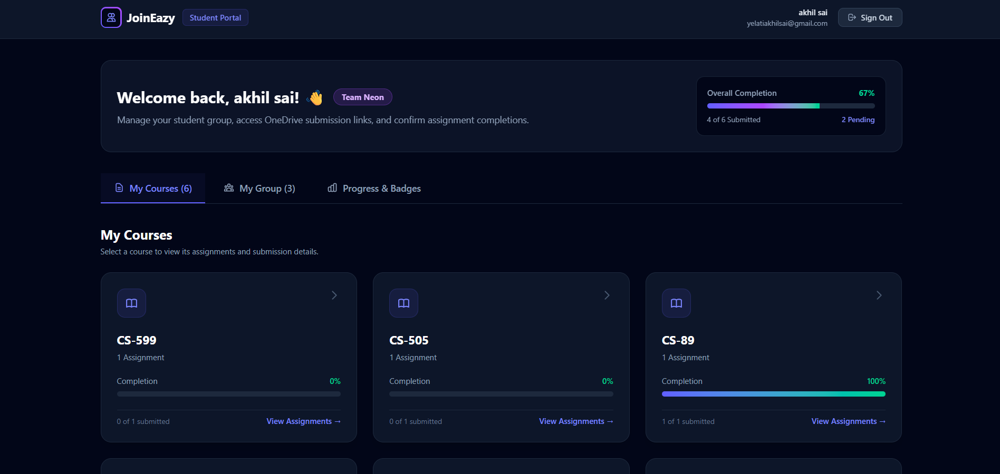
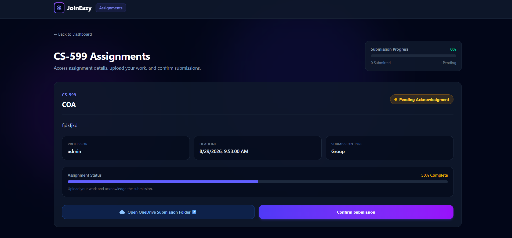
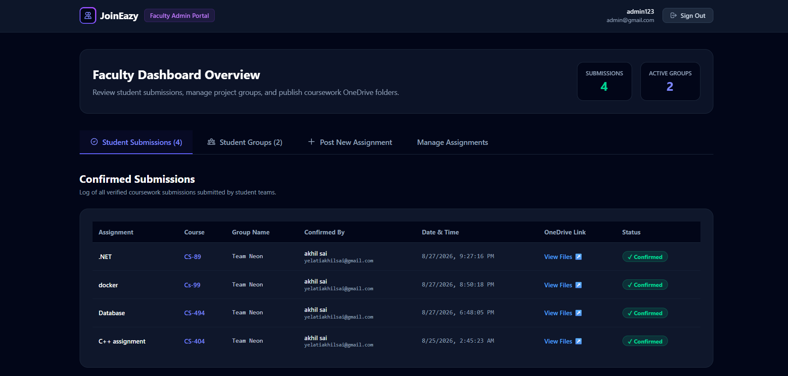
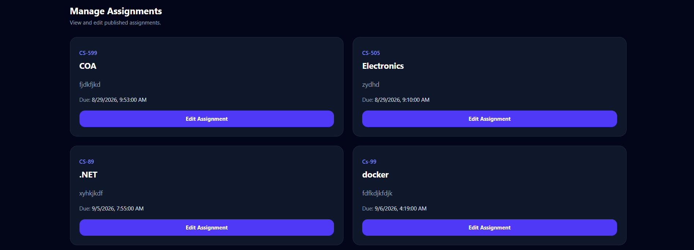

# JoinEazy – Student Assignment & Group Management System

JoinEazy is a full-stack web application designed to help students and faculty manage courses, assignments, student groups, and assignment submissions in one place.

The application provides separate workflows for students and faculty/admin users, with role-based authentication and protected dashboards.

---

## 🚀 Features

### 👨‍🎓 Student

- JWT-based student authentication
- Protected student dashboard
- View available courses
- View assignments
- View assignment details
- Access OneDrive submission folders
- Create student groups
- Add members to groups
- View group members and group leader
- Submit/acknowledge assignments
- Group leader validation for group submission acknowledgment
- Submission status tracking

### 👨‍🏫 Faculty / Admin

- JWT-based authentication
- Protected faculty dashboard
- View student submissions
- View registered student groups
- Create assignments
- View assignments
- Edit assignments
- Assign courses and professors
- Provide assignment descriptions and deadlines
- Add OneDrive submission folder links
- Track confirmed submissions

### 🔐 Authentication & Authorization

- JWT authentication
- Role-based access control
- Separate student and faculty/admin workflows
- Protected frontend routes
- Protected backend API routes
- Only authorized users can access protected resources

---

# 🛠️ Tech Stack

## Frontend

- React.js
- React Router
- Tailwind CSS
- Axios
- Vite

## Backend

- Node.js
- Express.js
- JWT
- PostgreSQL
- `pg`
- REST APIs

## Database

- PostgreSQL
- Neon PostgreSQL

---

# 📁 Project Structure

```text
JoinEazy/
│
├── Frontend/
│   ├── src/
│   │   ├── Components/
│   │   │   └── ProtectedRoute.jsx
│   │   │
│   │   ├── Pages/
│   │   │   ├── Home.jsx
│   │   │   ├── Login.jsx
│   │   │   ├── Register.jsx
│   │   │   ├── StudentDashboard.jsx
│   │   │   ├── Assignments.jsx
│   │   │   └── Group.jsx
│   │   │
│   │   ├── Admin/
│   │   │   └── AdminDashboard.jsx
│   │   │
│   │   ├── Services/
│   │   │   └── api.js
│   │   │
│   │   └── App.jsx
│   │
│   ├── package.json
│   └── ...
│
├── Backend/
│   ├── controllers/
│   │   ├── assignment.controllers.js
│   │   ├── group.controllers.js
│   │   └── submission.controllers.js
│   │
│   ├── routes/
│   │   ├── assignment.routes.js
│   │   ├── group.routes.js
│   │   └── submission.routes.js
│   │
│   ├── middlewares/
│   │   ├── auth.middlewares.js
│   │   └── role.middlewares.js
│   │
│   ├── db/
│   │   └── connectdb.js
│   │
│   ├── ...
│   └── package.json
│
└── README.md
```

---

# 🗄️ Database Structure

The application uses PostgreSQL.

Main tables:

```text
users
courses
assignments
groups
group_members
submissions
```

### Users

Stores authentication and role information.

```text
id
name
email
password
role
created_at
```

### Courses

Stores available courses.

```text
id
name
```

Assignments are associated with courses through `course_id`.

### Assignments

Stores assignment information.

```text
id
title
description
due_date
onedrive_link
created_by
created_at
course
course_id
professor
```

Each assignment is associated with a course and the faculty/admin user who created it.

### Groups

Stores student groups.

```text
id
name
code
created_by
created_at
```

The creator of a group becomes the group leader.

### Group Members

Connects students with groups.

```text
id
group_id
student_id
role
joined_at
```

The `role` field identifies whether the student is:

```text
leader
member
```

### Submissions

Tracks assignment acknowledgments/submissions.

```text
id
assignment_id
group_id
confirmed_by
confirmed_at
```

For group assignments, the group leader is responsible for confirming the submission.

---

# 🔗 Database Relationships

```text
Users
  │
  ├───────────────┐
  │               │
  ▼               ▼
Assignments      Groups
  │               │
  │               ▼
  │         Group Members
  │               │
  ▼               ▼
Submissions ◄─────┘
  │
  ▼
Assignments
  │
  ▼
Courses
```

The relationships allow the application to associate:

- Students with groups
- Assignments with courses
- Groups with assignment submissions
- Submission acknowledgments with users

---

# 🔐 Authentication Flow

The application uses JWT-based authentication.

```text
User
 │
 ▼
Login
 │
 ▼
Backend validates credentials
 │
 ▼
JWT generated
 │
 ▼
Authenticated request
 │
 ▼
Auth Middleware
 │
 ▼
Role Middleware
 │
 ├── Student → Student Dashboard
 │
 └── Admin   → Faculty Dashboard
```

Protected frontend routes prevent unauthorized users from accessing student or admin pages.

---

# 📝 Assignment Flow

### Faculty/Admin

```text
Login
  ↓
Faculty Dashboard
  ↓
Post New Assignment
  ↓
Select/Add Course
  ↓
Enter Assignment Details
  ↓
Add Deadline
  ↓
Add OneDrive Submission Folder
  ↓
Publish Assignment
```

Faculty can also:

```text
Manage Assignments
       ↓
Select Assignment
       ↓
Edit Assignment
       ↓
Save Changes
```

### Student

```text
Login
  ↓
Student Dashboard
  ↓
Courses
  ↓
Assignments
  ↓
View Assignment
  ↓
Access Submission Folder
  ↓
Submit / Acknowledge
```

For group assignments, the group leader is responsible for acknowledging the submission.

---

# 👥 Group Management

Students can create groups and add members.

When a group is created:

```text
Student
   ↓
Create Group
   ↓
Group Created
   ↓
Creator becomes Leader
```

Other students can then be added as members.

The backend validates group membership and ensures that only the group leader can acknowledge a group submission.

---

# 🖥️ UI / UX Design

JoinEazy uses a dark-themed interface designed to provide a clean and focused academic dashboard experience.

### Design Choices

- Dark slate background reduces visual distraction.
- Indigo/purple accents are used for primary actions and navigation.
- Cards are used to separate different sections of information.
- Responsive layouts support desktop and smaller screens.
- Clear navigation tabs separate major dashboard functions.
- Status indicators provide quick visual feedback.
- Consistent spacing and rounded components improve readability.
- Forms use clear labels and validation for required fields.

The student and faculty dashboards use similar visual language while providing different functionality based on the user's role.

---

# ⚙️ Local Setup

## Prerequisites

Make sure the following are installed:

- Node.js
- npm
- PostgreSQL database / Neon PostgreSQL
- Git

---

# 📦 Backend Setup

Navigate to the backend folder:

```bash
cd Backend
```

Install dependencies:

```bash
npm install
```

Create a `.env` file:

```env
PORT=3000
DATABASE_URL=your_postgresql_connection_string
JWT_SECRET=your_jwt_secret
```

Start the backend:

```bash
npm run dev
```

The backend will run locally on:

```text
http://localhost:3000
```

> Do not commit your `.env` file to GitHub.

---

# 📦 Frontend Setup

Open another terminal:

```bash
cd Frontend
```

Install dependencies:

```bash
npm install
```

Start the development server:

```bash
npm run dev
```

The frontend will normally be available at:

```text
http://localhost:5173
```

---

# 🔗 API

The frontend communicates with the Express backend through REST APIs.

Examples include:

```text
POST /api/assignments/create
GET  /api/assignments/all
PUT  /api/assignments/:id

GET  /api/groups/all
GET  /api/groups/my
POST /api/groups/create

GET  /api/submissions/all
GET  /api/submissions/my
POST /api/submissions/confirm
```

Authentication and role middleware protect appropriate endpoints.

---

# 📸 Screenshots

Add screenshots of the completed application here.

Recommended screenshots:

- Login
- Student Dashboard
- Assignments
- Group Management
- Faculty Dashboard
- Assignment Management

Example:

```md
!(screenshots/home.png)








```

---

# 🎥 Video Demonstration

Add the video demonstration link after recording.

```text
Video Demo:
PASTE_YOUR_VIDEO_LINK_HERE
```

The video should demonstrate:

- Authentication
- Student dashboard
- Course and assignment flow
- Group management
- Assignment acknowledgment
- Faculty dashboard
- Assignment creation
- Assignment editing
- Submission monitoring
- Backend and database integration

---

# 🌐 Deployment

### Frontend

The React frontend can be deployed using:

- Netlify

### Backend

The Express backend can be deployed using platforms such as:

- Render

### Production Configuration

The deployed frontend should use the deployed backend API URL instead of:

```text
http://localhost:3000
```

Production environment variables should be configured on the hosting platform.

---

# 🔒 Security

The project includes:

- JWT authentication
- Protected routes
- Role-based authorization
- Password authentication
- Environment variables for sensitive configuration
- Backend validation
- Group membership validation
- Leader-only group acknowledgment

Sensitive values such as database credentials and JWT secrets should never be committed to the repository.

---

# 🚀 Future Improvements

Possible future improvements include:

- Individual assignment submission tracking
- More detailed submission analytics
- Assignment status filters
- Email notifications
- File upload support
- Course enrollment management
- Professor-specific dashboards
- More detailed progress analytics
- Automated deadline reminders

---

# 👨‍💻 Architecture

```text
React Frontend
      │
      │ REST API
      ▼
Express Backend
      │
      ▼
PostgreSQL / Neon
```

The project is separated into frontend and backend applications to make development, maintenance, testing, and deployment easier.

---

# 📄 License

This project was developed as part of a technical assignment/project evaluation.
